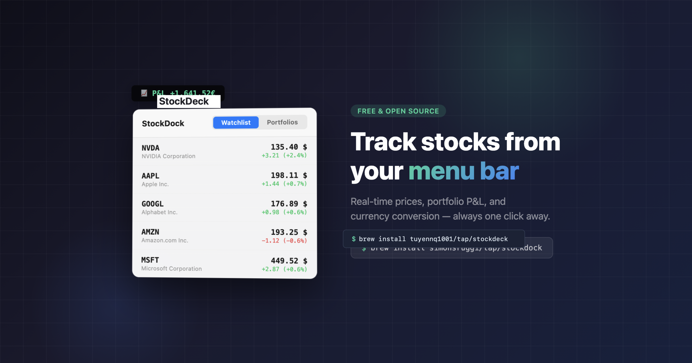

<div align="center">



# StockDeck

**A free, open-source macOS menu bar app for tracking stocks, ETFs, indices, crypto, and your portfolio P&L in real time.**

No account. No API keys. No subscription. No tracking. Just your watchlist and portfolio, always one click away in the menu bar.

<br>

[](https://github.com/tuyennq1001/stockdeck/releases/latest)
[](https://github.com/tuyennq1001/stockdeck/releases)
[](https://github.com/tuyennq1001/stockdeck/releases/latest)
[](https://swift.org)
[](LICENSE)
[](https://github.com/tuyennq1001/stockdeck)
[](https://github.com/sponsors/tuyennq1001)

<br>

```bash
brew install tuyennq1001/tap/stockdeck
```

**[⬇️ Download](https://github.com/tuyennq1001/stockdeck/releases/latest)** · **[✨ Features](#features)** · **[📸 Screenshots](#screenshots)** · **[❤️ Sponsor](https://github.com/sponsors/tuyennq1001)** · **[🐛 Report a bug](https://github.com/tuyennq1001/stockdeck/issues)**

</div>

---

> ⭐️ **Using StockDeck?** It's free and there's no tracking, so a GitHub star is the only way I know anyone's out there. If the app is useful to you, please [star the repo](https://github.com/tuyennq1001/stockdeck) — it takes a second and genuinely helps. And if you'd like to fuel development, you can [**❤️ sponsor me**](https://github.com/sponsors/tuyennq1001) — every feature stays free for everyone.

## 🆕 New in 1.0 — a full desktop app

StockDeck lives in your menu bar, but now it also opens into a complete desktop window. Click **Open** in the popover for your watchlist, portfolios, live charts, and news in one spacious view — everything stays in sync with the menu bar.


Also new: separate **Price** and **After-hours** columns in the watchlist (each sortable), **news search** by headline or ticker, add-to-portfolio straight from a stock's detail, sharper **forex / sub-dollar** price precision, and adjustable decimal places for percentages and values.

## Why StockDeck?

- 🆓 **Truly free & open source** — no paid tiers, no premium lock, no subscription, ever.
- 🔒 **Private by design** — no account, no login, no analytics, no telemetry. Your watchlist and portfolio never leave your Mac.
- ⚡️ **Live in your menu bar** — real-time P&L and prices without opening a single browser tab.
- 🖥️ **Full desktop app too** — open a spacious window for watchlist, portfolios, charts, and news whenever you want more room.
- 🌍 **Multi-currency** — track holdings in mixed currencies and see totals converted to yours, with historical rates on your cost basis.
- 🔔 **Alerts that reach you** — native macOS notifications plus optional Discord / Slack webhooks.
- 🍎 **Native & lightweight** — pure SwiftUI, universal binary (Apple Silicon + Intel), auto-updating via Sparkle.

## What you can track

Stocks, ETFs, indices (S&P 500, NASDAQ…), crypto, and forex — anything with a Yahoo Finance symbol. Search by **symbol**, **company name**, or **ISIN** (e.g. `AAPL`, `Tesla`, `IE00B4L5Y983`).

## Screenshots

### Desktop window


### In the menu bar


### The popover — watchlist, portfolios & settings

<div align="center">

</div>

| Watchlist | Portfolios | Settings |
|---|---|---|
|  |  |  |

## Features

- **Menu Bar P&L** — See your portfolio performance at a glance, always visible
- **Desktop Window** — Open a full app window from the menu bar: watchlist, portfolios, live charts, and news, all in sync
- **Watchlist** — Track any stock by symbol, name, or ISIN with live prices and daily change, with separate Price and after-hours columns you can sort
- **News Search** — Filter market news by headline, ticker, or publisher
- **52-Week Range** — A range bar in the watchlist showing where the price sits between its yearly low and high
- **Portfolios** — Create multiple portfolios with holdings, average cost, purchase date, and P&L
- **Long & Short + Leverage** — Track short positions and leveraged holdings with correct P&L math (optional, off by default)
- **Export / Import** — Export single or all portfolios to JSON and import them back
- **Extended Hours** — Pre-market and after-hours prices with PRE/POST badges
- **Currency Conversion** — Convert stock prices and portfolio values to your preferred currency
- **Price Alerts** — One-shot alerts on price thresholds, daily change %, or proximity to 52-week high/low
- **Portfolio Notifications** — Per-portfolio alerts for daily change %, change amount, value milestones, and a daily summary
- **Discord / Slack Webhooks** — Mirror every notification to a Discord or Slack webhook with colored embeds
- **Customizable Watchlist** — Toggle company name, day range, 52-week bar, and absolute change per row
- **Customizable Menu Bar** — Choose what to display: P&L, total value, percentages, best/worst stock, or just an icon
- **6 Languages** — English, German, French, Spanish, Italian, Portuguese
- **Auto-Updates** — Updates are delivered automatically via Sparkle, no manual downloads needed

## Install

### Homebrew (recommended)

```bash
brew install tuyennq1001/tap/stockdeck
```

The app updates itself automatically via Sparkle — no need to run `brew upgrade`.

### Download

1. Download the latest `StockDeck.zip` from [Releases](https://github.com/tuyennq1001/stockdeck/releases/latest)
2. Unzip and move `StockDeck.app` to `/Applications`
3. Launch — the app appears in the menu bar (no Dock icon)

### Build from source

Requires **Xcode 15+** and **macOS 14 Sonoma** or later.

```bash
git clone https://github.com/tuyennq1001/stockdeck.git
cd StockDeck
xcodebuild -scheme StockDeck -configuration Release -destination 'platform=macOS' -derivedDataPath .build/xcode build
```

The app bundle will be at `.build/xcode/Build/Products/Release/`.

## Usage

### Watchlist

Add stocks by clicking **Add stock** at the bottom of the Watchlist tab. Search by symbol, company name, or ISIN (e.g. `AAPL`, `Tesla`, `IE00B4L5Y983`). A local filter box lets you quickly narrow the list by name, symbol, or ISIN. Stocks show:

- Current price with currency symbol
- Daily change (absolute and percentage)
- Day range (low – high)
- A 52-week range bar with a marker showing where the price sits between its yearly low and high
- Extended hours price when available (PRE/POST badge)

Each of these rows can be toggled on/off in **Settings → Watchlist Display**.

Right-click a stock to remove it, add it to a portfolio, or create a price alert.

### Portfolios

1. Click the **Portfolios** tab
2. Click **New portfolio** to create one
3. Click **Add holding** to add a stock with quantity, average price, and purchase date

The purchase date is used to apply the historical exchange rate to your cost basis, so P&L stays accurate across currencies.

Each portfolio shows:
- **Total value** in your chosen currency
- **P&L** (profit & loss) in absolute and percentage terms
- Per-holding breakdown with price, value, and individual P&L

Right-click a holding to edit or delete it. Right-click a portfolio header to configure its notifications.

You can **Export** a single portfolio (or **Export All**) to a JSON file, and **Import** portfolios back — imports regenerate IDs and de-duplicate names so nothing is overwritten.

### Long / Short & Leverage

By default every holding is a plain long position. Turn on **Settings → Advanced → "Enable short positions & leverage"** to unlock a **Long / Short** picker and a per-holding **leverage** field when adding or editing a holding. P&L, market value, and portfolio percentages are computed with the correct sign and exposure so long and short baskets don't cancel each other out. Existing portfolios are unaffected — the feature is opt-in.

### Price Alerts

Create a one-shot alert from a watchlist stock's right-click menu. Six conditions are supported:

- Price rises above a threshold
- Price falls below a threshold
- Daily change rises above a % 
- Daily change falls below a %
- Price gets near its 52-week high
- Price gets near its 52-week low

Alerts are evaluated on every price update (WebSocket tick, REST refresh, launch, and wake). When triggered they fire a local macOS notification once, then disarm. Manage them in **Settings → Notifications**: re-arm, delete, or see the "triggered" badge.

### Portfolio Notifications

Right-click a portfolio header → **Notifications…** to configure per-portfolio alerts. Four modes:

- **Daily change ≥ %** — fires when the portfolio moves by at least a given percentage
- **Daily change ≥ amount** — fires on an absolute move in your portfolio currency
- **Value milestone** — fires when total value crosses a milestone (e.g. every 10,000)
- **Daily summary** — a recap delivered after a set time of day

Step-based anti-spam with hysteresis prevents repeat firing within the same step (re-fires only on the next step, resets daily). Rules and state persist per portfolio in `data.json`.

### Discord / Slack Webhooks

In **Settings → Notifications**, enable the webhook toggle and paste a Discord or Slack webhook URL. Every notification (price alerts and portfolio notifications) is mirrored to the webhook in addition to the macOS notification. The app auto-detects Discord (colored green/red embeds) vs Slack (text), and only posts to `https` URLs on known hosts (SSRF-safe). Use **Send test** to verify it works.

### Settings

Click the gear icon tab to configure:

| Setting | Description |
|---|---|
| **Stock Price Currency** | Convert all displayed prices to a single currency, or keep original |
| **Portfolio Currency** | Base currency for portfolio totals and P&L (EUR, USD, GBP, CHF, JPY, CAD, AUD) |
| **Show Extended Hours** | Toggle pre-market and after-hours prices on/off — affects prices, P&L, and menu bar |
| **Watchlist Display** | Toggle company name, day range, 52-week range bar, and absolute change value per row |
| **Menu Bar Display** | What appears in your menu bar (see below) |
| **Language** | English, German, French, Spanish, Italian, Portuguese |
| **Notifications** | Discord/Slack webhook, plus management of price alerts and portfolio notifications |

### Menu Bar Display Options

| Option | Example |
|---|---|
| P&L | `P&L +321.09€` |
| P&L % | `P&L +2.3%` |
| P&L + % | `+321.09€ (+2.3%)` |
| Total Value | `14396.67€` |
| Best Stock | `AAPL +1.2%` |
| Worst Stock | `TSLA -0.8%` |
| Best & Worst | `▲AAPL +1.2%  ▼TSLA -0.8%` |
| Icon Only | Chart icon |

Best/Worst are based on daily change % from your watchlist.

## Updates

StockDeck checks for updates automatically on launch via [Sparkle](https://sparkle-project.org/). You can also check manually from **Settings → Check for Updates**. No action needed — updates install seamlessly in the background.

## Data & Privacy

- Real-time prices via Yahoo Finance WebSocket (~1 update/sec per symbol)
- REST polling every 5 min as fallback for exchange rates
- All data is stored locally in `~/Library/Application Support/StockDeck/data.json` (watchlist, portfolios, alerts, portfolio notifications, webhook, and preferences)
- No data is sent anywhere — the app only talks to Yahoo Finance APIs (and your own Discord/Slack webhook, if you enable it)
- No account required, no API keys needed

## FAQ

**Is StockDeck really free?**
Yes — free and open source under the MIT license, with no paid tier or subscription. If you want to support development, you can optionally [sponsor me](https://github.com/sponsors/tuyennq1001).

**Does it work on Intel Macs?**
Yes. StockDeck ships as a universal binary for both Apple Silicon and Intel, on macOS 14 (Sonoma) and later.

**Where does the data come from?**
Public Yahoo Finance endpoints (WebSocket for live prices, REST for exchange rates). No API key needed.

**Can I track crypto, ETFs, or indices?**
Yes — anything with a Yahoo Finance symbol, including crypto, ETFs, and market indices.

**Do you collect any data about me?**
No. There's no analytics, no telemetry, no account. Everything stays local on your Mac.

**How do I uninstall it?**
`brew uninstall stockdeck` (or drag the app to the Trash), then optionally delete `~/Library/Application Support/StockDeck`.

## Tech Stack

- Swift 5.9 / SwiftUI
- macOS 14+ (Sonoma) — Universal binary (Apple Silicon + Intel)
- Yahoo Finance WebSocket (real-time) + REST API (fallback)
- [Sparkle](https://sparkle-project.org/) for auto-updates
- [swift-protobuf](https://github.com/apple/swift-protobuf) for WebSocket decoding

## Support the project

StockDeck is **free and open source, and it will always stay that way** — no paid tiers, no premium lock, no subscription, ever. It's also completely private: there's no analytics, no telemetry, no way for me to know how many people use it.

If you find it useful, the best (and free) thing you can do is **[⭐️ star the repo](https://github.com/tuyennq1001/stockdeck)** — it's quick and it's the only signal I get that the app is worth maintaining.

And if you'd like to go a step further, you can **[💛 sponsor me on GitHub](https://github.com/sponsors/tuyennq1001)**. It's completely optional and changes nothing about the app — every feature stays free for everyone — but it helps me keep building and maintaining StockDeck and my other open-source projects. Thank you! 🙏

## License

[MIT](LICENSE) © [Simone Ruggiero](https://simoneruggiero.com)
